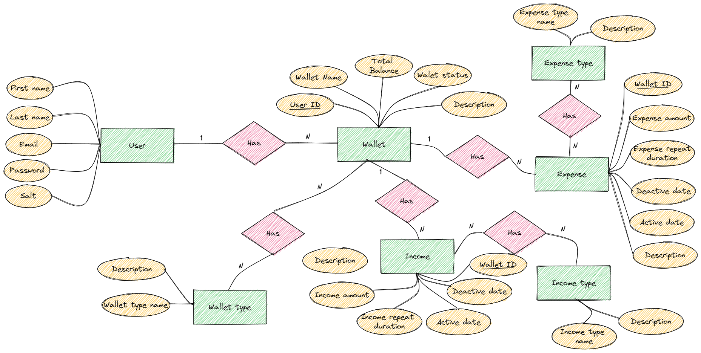
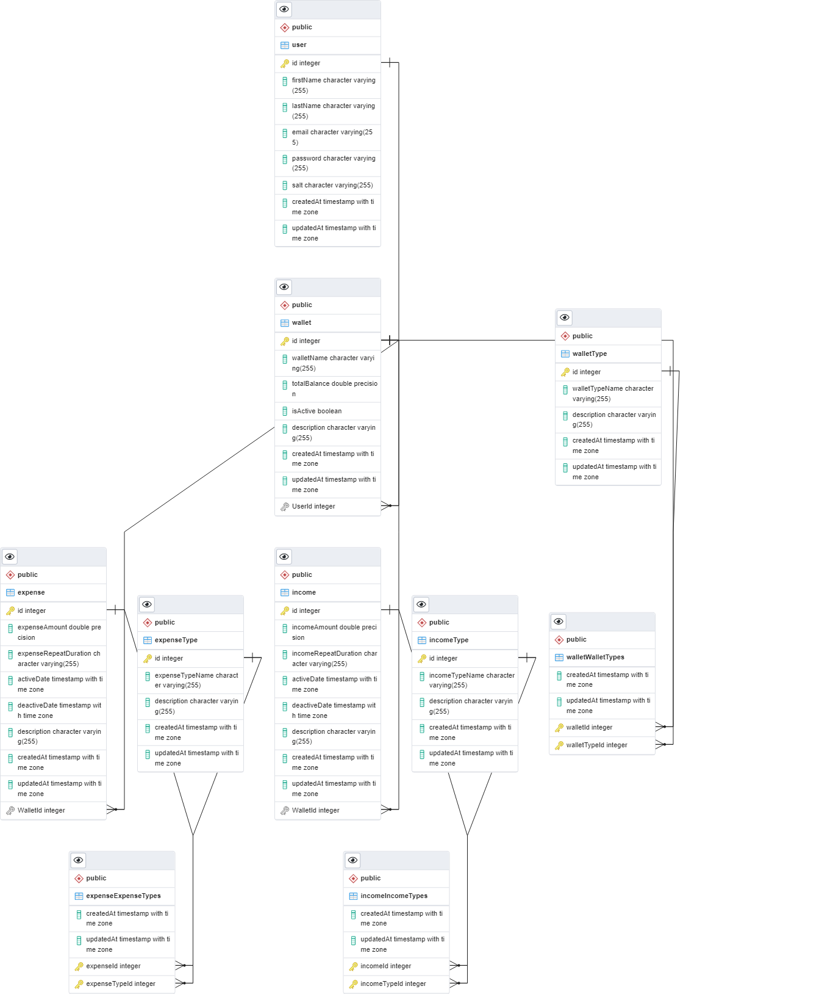

# PFM

Personal Finance Management

A project to help managing personal finance

### Entity Relationship Diagram

Details:

### Models description 

**User**
|Column|Type|Description|
|---|---|---|
|firstName|string|User's first name|
|lastName|string|User's last name|
|email|string|User's email, must be unique|
|password|string|User's hashed password for auth must have a length of more than 8 characters and has at least 1 capitalized character|
|salt|string|A string for hash user's password|

Constrains:
- One user can have multiple wallets

**Wallet**
|Column|Type|Description|
|---|---|---|
|walletName|string|User's wallet name, must be unique|
|totalBalance|float|User's wallet balance, default value is 0|
|isActive|boolean|User's wallet status, true if the wallet is active|
|description|string (or must be text)|Description for the wallet|

Constrains:
- One wallet can have multiple incomes
- One wallet can have multiple expenses 

---

**Expense**

**TODO: Add the currency support**
|Column|Type|Description|
|---|---|---|
|expenseAmount|float|One-time spending amount record or recurring spending amount record|
|expenseRepeatDuration|string|Used for recurring expenses, can be a string with following parttern: `number\|TimeDuration`. For example: `2\|m` is for every two months, `1\|w` is for every week. `3\|d` for every three days. The TimeDuration can be: `d` for `day`, `m` for `month`, `w` for `week`, `y` for `year`|
|activeDate|date|The date this expense is active|
|deactiveDate|date|The date this expense is deactive|
|description|string|description for this expense| 

Constrains:
- An expense can belong to multiple expense types

---

**Expense Type**

|Column|Type|Description|
|---|---|---|
|expenseTypeName|string|A group name for expenses|
|description|string|description for expenses' type|

- An expense type can have multiple expenses 

---
**Income**

**TODO: Add the currency support**
|Column|Type|Description|
|---|---|---|
|incomeAmount|float|One-time income amount record or recurring income amount record|
|incomeRepeatDuration|string|Used for recurring income, can be a string with following parttern: `number\|TimeDuration`. For example: `2\|m` is for every two months, `1\|w` is for every week. `3\|d` for every three days. The TimeDuration can be: `d` for `day`, `m` for `month`, `w` for `week`, `y` for `year`|
|activeDate|date|The date this income is active|
|deactiveDate|date|The date this income is deactive|
|description|string|description for this income| 

Constrains:
- An income can belong to multiple income types

---

**Income Type**

|Column|Type|Description|
|---|---|---|
|incomeTypeName|string|A group name for incomes|
|description|string|description for incomes' type|

- An income can have multiple incomes 

### Techstack

**Backend frameworks**:

- NodeJS - ExpressJS
- ORM: sequelize

**Database**:

- Postgresql

**Cache**:

- Redis

**Frontend**:

- Update later...

### Installation

Update later...
